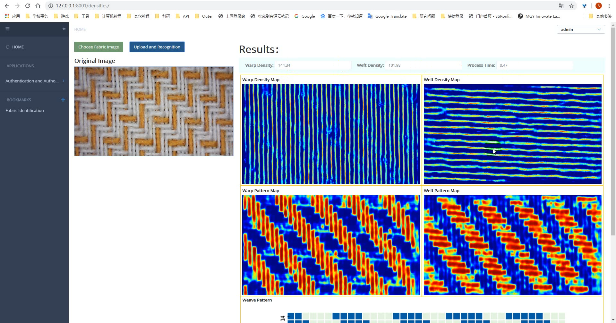

# An Online Project for the Recognition of Fabric Structure Parameters Based on MTMSnet and Django
This is a web project for the recognition of fabric structure paramers, including fabric density measurement, weave pattern recognition, color pattern recognition

## Papers

[Shuo Meng, Ruru Pan, Weidong Gao, Jian Zhou, Jingan Wang, Wentao He. A multi-task and multi-scale convolutional neural network for automatic recognition of woven fabric pattern. Journal of Intelligent Manufacturing.](https://doi.org/10.1007/s10845-020-01607-9)

[Shuo Meng, Jingan Wang, Ruru Pan, Weidong Gao, Jian Zhou, Wentao He. Recognition of the layout of colored yarns in yarn-dyed fabrics. Textile Research Journal.]( https://doi.org/10.1177/0040517520932830)

[Shuo Meng, Ruru Pan, Weidong Gao, Jian Zhou, Jingan Wang, Wentao He. Woven Fabric Density Measurement by Using Multi-Scale Convolutional Neural Networks. IEEE Access.]( https://doi.org/10.1109/ACCESS.2019.2922502)

## Usage
### Requirements
See in requirements.txt

For MTMSnet, please find in [MTMSnet](https://github.com/breeeak/MTMSnet-initial/tree/master/MTMSnet-dev)

## Citation
If you use this code for your research, please cite our papers.

## Note
This is only an initial demo and the full version will be coming soon.
